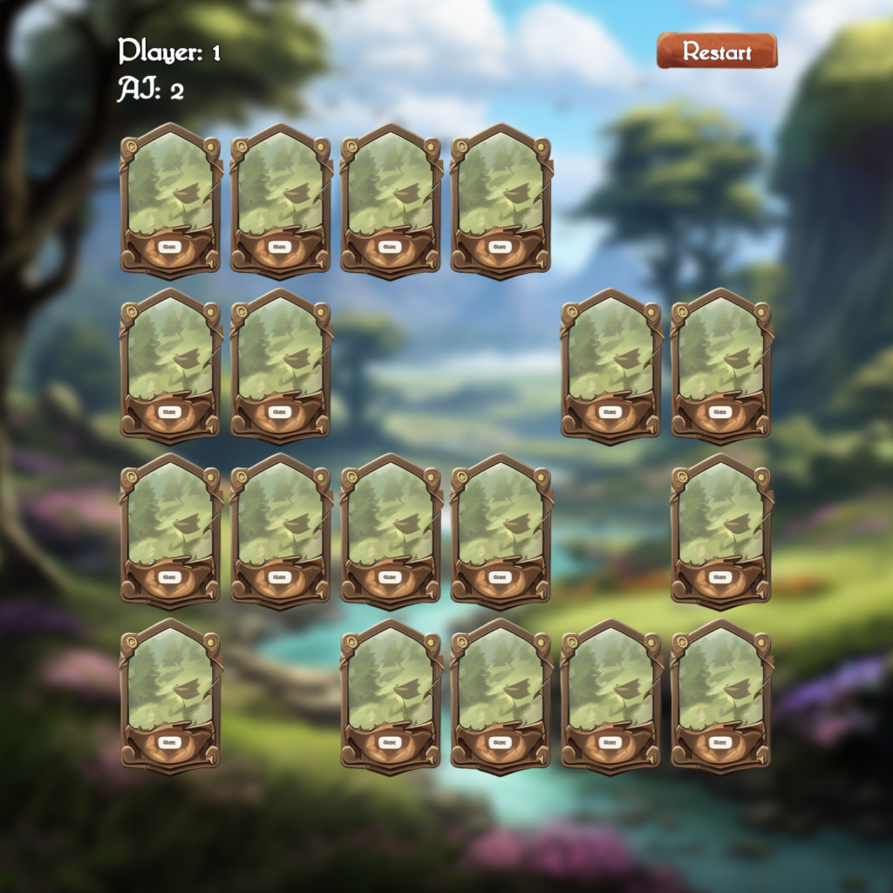

# Fantasy Matching Card Game
<!-- section: Introduction -->
<!-- Describe briefly what your software is. What problem does it solve? At what target audience is it aimed? -->

This is a matching card game with a fantasy theme. The objective is to find matching pair of cards. You can turn a card by clicking on it. When clicking a second card and the cards match you get a point and the pair is removed from the game. If they don't match the cards are both turned back and it's your opponents turn. Your opponent is controlled by an AI. Good luck!

## Overview
<!-- section: Overview -->
<!-- Give an architectural overview of your software. Is is interesting for other developers, who wants to catch on and want to developer features or fix bugs of your software. Do not go into too much detail. There are other documents for this. -->
Nothing to see here, as this is only an exercise. There is a single game state. This project utilizes https://www.npmjs.com/package/@dasheck0/phaser-boilerplate, which is under heavy development. So this might be broken. Enjoy some screenshots

<p float="left">
  
  
</p>


## Development
<!-- section: Development -->
<!-- If you software is developed within a team you shhould include this section. Describe how to setup thhe project. Include dependencies, conventions and other things to know in order to start developing. In short: After reading this section everyone should be able to develop this piece of software. -->
<!--
Possible subsections

### How to setup and run this project
### Commit messages
### How to publish a release
### Tests
-->
Checkout the repo run `npm i` and then `npm start`.

## Contributing
<!-- section: Contributing -->
<!-- Describe what action one should take in order to contribute. Does a certain styleguide has to be adhered. How can one apply changes (i.e. push vs. pull request)? -->
Bug reports and pull requests are welcome on GitHub at {URL}. This project is intended to be a safe, welcoming space for collaboration, and contributors are expected to adhere to the Contributor Covenant code of conduct.

## License
<!-- section: License -->
<!-- Describe the license under which your software is published. Note that an unlicensed piece of software is most likely never used. So do not skip tihs part! -->
```
MIT License Copyright (c) 2023 Stefan Neidig

Permission is hereby granted, free
of charge, to any person obtaining a copy of this software and associated
documentation files (the "Software"), to deal in the Software without
restriction, including without limitation the rights to use, copy, modify, merge,
publish, distribute, sublicense, and/or sell copies of the Software, and to
permit persons to whom the Software is furnished to do so, subject to the
following conditions:

The above copyright notice and this permission notice
(including the next paragraph) shall be included in all copies or substantial
portions of the Software.

THE SOFTWARE IS PROVIDED "AS IS", WITHOUT WARRANTY OF
ANY KIND, EXPRESS OR IMPLIED, INCLUDING BUT NOT LIMITED TO THE WARRANTIES OF
MERCHANTABILITY, FITNESS FOR A PARTICULAR PURPOSE AND NONINFRINGEMENT. IN NO
EVENT SHALL THE AUTHORS OR COPYRIGHT HOLDERS BE LIABLE FOR ANY CLAIM, DAMAGES OR
OTHER LIABILITY, WHETHER IN AN ACTION OF CONTRACT, TORT OR OTHERWISE, ARISING
FROM, OUT OF OR IN CONNECTION WITH THE SOFTWARE OR THE USE OR OTHER DEALINGS IN
THE SOFTWARE.
```
